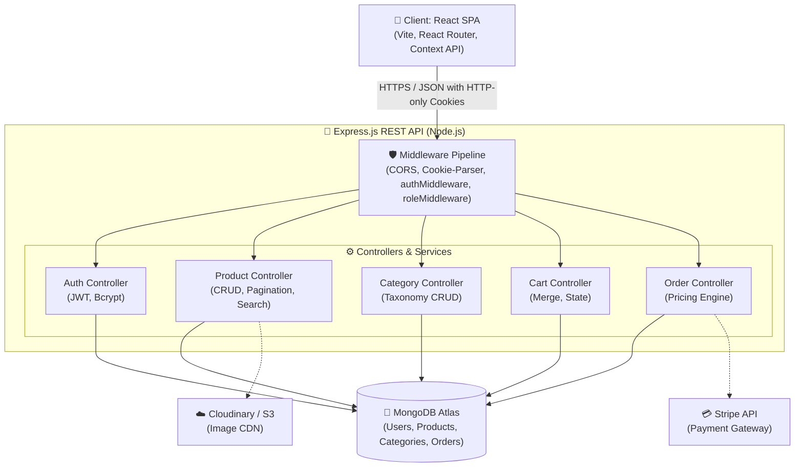

# 🛒 Vyoma E-Commerce Platform — System Architecture & Implementation Blueprint

An enterprise-grade, high-performance **MERN Stack (MongoDB, Express, React, Node.js)** e-commerce web application featuring role-based access control, server-side pricing validation, hybrid cart synchronization, and dynamic product catalogs.

---

## 📁 Project Map (Folder Structure)

```
ecommerce-platform/
│
├── backend/
│   ├── config/
│   │   ├── db.js                 # MongoDB Atlas connection (Mongoose)
│   │   └── env.js                # Environment variable loader & validator
│   ├── models/
│   │   ├── User.js               # User model with bcrypt password hashing & RBAC
│   │   ├── Product.js            # Product catalog with full-text search indexing
│   │   ├── Category.js           # Category hierarchy model
│   │   ├── Cart.js               # Server-side user shopping cart
│   │   └── Order.js              # Orders with snapshot pricing & status tracking
│   ├── controllers/
│   │   ├── authController.js     # Register, Login (JWT cookie), GetMe, Logout
│   │   ├── productController.js  # Product CRUD, pagination, multi-field filters
│   │   ├── categoryController.js # Category CRUD
│   │   ├── cartController.js     # Cart operations & guest-to-user sync
│   │   └── orderController.js    # Order checkout & Stripe payment processing
│   ├── routes/
│   │   ├── authRoutes.js         # /api/auth
│   │   ├── productRoutes.js      # /api/products
│   │   ├── categoryRoutes.js     # /api/categories
│   │   ├── cartRoutes.js         # /api/cart
│   │   └── orderRoutes.js        # /api/orders
│   ├── middleware/
│   │   ├── authMiddleware.js     # HTTP-only cookie + Bearer JWT verification
│   │   ├── roleMiddleware.js     # Role-based access control (Admin vs Customer)
│   │   ├── errorMiddleware.js    # Central error handler (CastError, Duplicate, Validation)
│   │   └── uploadMiddleware.js   # Image upload handling
│   ├── utils/
│   │   ├── generateToken.js      # JWT token generator
│   │   └── hashPassword.js       # Bcrypt hash utility
│   ├── server.js                 # Express application entry point
│   └── package.json
│
├── frontend/
│   ├── src/
│   │   ├── api/
│   │   │   ├── axiosInstance.js  # Central Axios client with credentials: true
│   │   │   ├── authApi.js        # Auth endpoints connector
│   │   │   └── productApi.js     # Products & categories API connector
│   │   ├── components/
│   │   │   ├── common/           # Loader, Pagination
│   │   │   └── product/          # ProductCard, ProductGrid, ProductFilter
│   │   ├── context/
│   │   │   └── AuthContext.jsx   # Global session state & cookie restore on mount
│   │   ├── hooks/
│   │   │   └── useAuth.js        # Custom auth context hook
│   │   ├── pages/
│   │   │   ├── Home.jsx           # Clean Hero landing page with Start Shopping CTA
│   │   │   ├── Products.jsx       # Full storefront catalog with search & filters
│   │   │   ├── ProductDetails.jsx # Single product view with stock selector
│   │   │   ├── Login.jsx          # User sign in
│   │   │   ├── Register.jsx       # User registration
│   │   │   └── Profile.jsx        # Protected profile page
│   │   ├── routes/
│   │   │   ├── ProtectedRoute.jsx # Logged-in user route guard
│   │   │   └── AdminRoute.jsx     # Admin-only role route guard
│   │   ├── App.jsx                # Router & AuthProvider hierarchy
│   │   ├── index.css              # Glassmorphic dark-mode design system
│   │   └── main.jsx               # React DOM entry
│   └── package.json
│
└── Readme.md
```

---

## 🧱 Layer 1 — Architecture (System Level & High-Level Design / HLD)

> 🎙️ **Interview Pitch (2-Minute Elevator Pitch):**  
> *"I built a scalable 3-tier e-commerce platform using the MERN stack. The frontend is a React Single Page Application that handles client-side state and communicates with a stateless Express.js REST API. The backend strictly follows a layered architecture (Routes → Middleware Pipeline → Controllers → Models) connected to MongoDB Atlas. For security, authentication uses JWTs transmitted via HTTP-only, SameSite cookies to eliminate XSS token theft while defending against CSRF. The checkout flow enforces server-side price re-computation and inventory checks to prevent client-side price tampering, with Stripe handling tokenized payments."*

---

### 1. System Requirements & Design Goals

```
┌─────────────────────────────────────────────────────────────────────────┐
│                        REQUIREMENTS BREAKDOWN                           │
├────────────────────────────────────┬────────────────────────────────────┤
│ 🎯 Functional Requirements         │ ⚡ Non-Functional Requirements     │
├────────────────────────────────────┼────────────────────────────────────┤
│ • Secure Auth (Customer & Admin)   │ • Security: XSS & CSRF mitigation  │
│ • Catalog Search, Filter & Sort    │   via HTTP-only SameSite cookies   │
│ • Dynamic Pagination & Category Hub│ • Scalability: Stateless REST APIs │
│ • Hybrid Cart (Guest & User Merge) │ • Reliability: Server-side pricing │
│ • Order Checkout & Payment Gateway │   re-computation & inventory check │
│ • Admin Management for Products/Cat│ • Speed: Parallel DB queries       │
└────────────────────────────────────┴────────────────────────────────────┘
```

---

### 2. High-Level Architecture Diagram



#### ASCII System Flow
```
                       ┌─────────────────────────┐
                       │   Client (React SPA)    │
                       │ Vite + React Router DOM │
                       └────────────┬────────────┘
                                    │ HTTPS (JSON / REST API)
                                    ▼
                       ┌─────────────────────────┐
                       │  Express API (Node.js)  │
                       │  • Cookie Parser & CORS │
                       │  • JWT Auth Middleware  │
                       │  • RBAC (Role) Check    │
                       │  • Central Error Filter │
                       └─────┬──────────────┬────┘
                             │              │
                ┌────────────┴──┐        ┌──┴─────────────┐
                ▼               ▼        ▼                ▼
         ┌─────────────┐ ┌─────────────┐ ┌──────────┐ ┌──────────┐
         │ User / Auth │ │ Product/Cart│ │  Orders  │ │ Stripe   │
         │ Controller  │ │ Controller  │ │Controller│ │ Payment  │
         └──────┬──────┘ └──────┬──────┘ └────┬─────┘ └──────────┘
                │               │             │
                └───────────────┼─────────────┘
                                ▼
                       ┌─────────────────┐
                       │ MongoDB Atlas   │
                       │ (Mongoose ODM)  │
                       └─────────────────┘
```

---

### 3. Key Engineering Trade-Offs (Interview Q&A)

| Architectural Decision | Choice Made | Why? (The Engineering Rationale) |
|---|---|---|
| **JWT Storage** | **HTTP-Only Cookies** | Storing JWTs in `localStorage` exposes tokens to Cross-Site Scripting (XSS). HTTP-only cookies prevent JavaScript from accessing tokens. |
| **Pricing Strategy** | **Server-Side Recomputation** | Never trust client-side prices. The backend looks up prices from MongoDB at the moment of order creation. |
| **Catalog Performance** | **`Promise.all` Parallelism** | Product fetching and total count queries run concurrently, cutting API latency in half. |
| **Database Indexing** | **Compound & Text Indexes** | Compound indexes on `category` and `price`, plus text index on `name`, enable fast sub-millisecond filtering. |

---

## 🧩 Layer 2 — Modules (Functional Breakdown)

| Module | Backend Components | Frontend Components | Primary Dependency |
|---|---|---|---|
| **Authentication** | User model, `authController`, JWT utils, `authMiddleware` | `Login.jsx`, `Register.jsx`, `AuthContext.jsx`, `ProtectedRoute.jsx` | Foundational |
| **Product Catalog** | Product model, Category model, `productController`, `categoryController` | `Products.jsx`, `ProductCard`, `ProductFilter`, `ProductGrid`, `Pagination` | Auth (for admin mutations) |
| **Shopping Cart** | Cart model, `cartController` | `CartContext`, Cart Drawer, CartItem | Auth & Product |
| **Checkout & Payments** | Order model, `orderController`, Stripe SDK | Checkout page, Payment Form | Cart, Auth, Product |
| **Admin Panel** | `roleMiddleware("admin")`, CRUD handlers | `AdminRoute.jsx`, `AdminDashboard` | Auth (role=admin) |

---

## 📡 API Endpoints Reference

### 🔐 Authentication (`/api/auth`)
| Method | Endpoint | Description | Access |
|---|---|---|---|
| `POST` | `/api/auth/register` | Register a new user account | Public |
| `POST` | `/api/auth/login` | Authenticate user & issue HTTP-only JWT cookie | Public |
| `GET` | `/api/auth/me` | Fetch currently logged-in user profile | Private (Logged-in User) |
| `POST` | `/api/auth/logout` | Clear authentication cookie | Public |

### 📦 Products (`/api/products`)
| Method | Endpoint | Description | Access |
|---|---|---|---|
| `GET` | `/api/products` | Get products (search, category, price filter, sort, pagination) | Public |
| `GET` | `/api/products/:id` | Get single product details by ID | Public |
| `POST` | `/api/products` | Create a new product | Private (Admin only) |
| `PUT` | `/api/products/:id` | Update product details | Private (Admin only) |
| `DELETE` | `/api/products/:id` | Delete product by ID | Private (Admin only) |

### 🏷️ Categories (`/api/categories`)
| Method | Endpoint | Description | Access |
|---|---|---|---|
| `GET` | `/api/categories` | Get all active categories | Public |
| `GET` | `/api/categories/:id` | Get single category details | Public |
| `POST` | `/api/categories` | Create new product category | Private (Admin only) |
| `PUT` | `/api/categories/:id` | Update category name/description | Private (Admin only) |
| `DELETE` | `/api/categories/:id` | Delete category by ID | Private (Admin only) |

### 🛒 Cart (`/api/cart`)
| Method | Endpoint | Description | Access |
|---|---|---|---|
| `GET` | `/api/cart` | Get current user's database cart | Private (Logged-in User) |
| `POST` | `/api/cart` | Add item to cart | Private (Logged-in User) |
| `PUT` | `/api/cart/:itemId` | Update cart item quantity | Private (Logged-in User) |
| `DELETE` | `/api/cart/:itemId` | Remove an item from cart | Private (Logged-in User) |
| `POST` | `/api/cart/merge` | Merge guest localStorage cart into database cart | Private (Logged-in User) |

### 💳 Orders & Checkout (`/api/orders`)
| Method | Endpoint | Description | Access |
|---|---|---|---|
| `POST` | `/api/orders` | Verify cart, charge payment, and create order | Private (Logged-in User) |
| `GET` | `/api/orders/myorders` | Fetch logged-in user's order history | Private (Logged-in User) |
| `GET` | `/api/orders/:id` | Get single order details | Private (Logged-in User / Admin) |
| `GET` | `/api/orders` | Fetch all orders in system | Private (Admin only) |
| `PUT` | `/api/orders/:id/status` | Update order shipment/delivery status | Private (Admin only) |

---

## 🚀 Getting Started

### Prerequisites
* Node.js (v18+)
* MongoDB Atlas connection string
* Git

### 1. Clone & Setup Backend
```bash
cd backend
npm install
# Create a .env file with:
# PORT=5000
# MONGO_URI=your_mongodb_connection_string
# JWT_SECRET=your_secret_key
# JWT_EXPIRES_IN=7d
# NODE_ENV=development
# FRONTEND_URL=http://localhost:5173
npm run dev
```

### 2. Setup Frontend
```bash
cd frontend
npm install
npm run dev
```

Open `http://localhost:5173` in your browser to view the application!